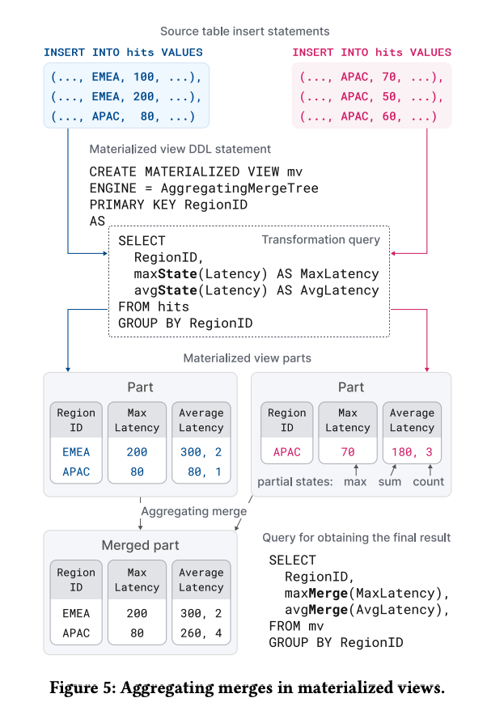
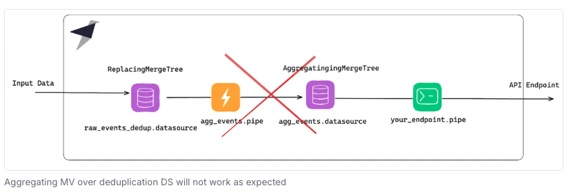

# Tinybird Workshop on Materialized Views

This repository is a companion piece to the 'Materialized Views' workshop. The intended audience of this workshop are folks who have some experience with Tinybird and are interested in learning how Materialized Views (MVs) are implemented with Tinybird.

## Common use cases for Materialized Views

* Updating schemas:
  * Dropping columns to focus on attributes of interest and reduce the amount of data processed.
  * Updating sorting keys. As you serve more and more use cases, with incoming queries focused on different data attributes, you may benefit from providing MV-driven Data Sources with different sorting keys. For example, you may want to organize data by product IDs and customer IDs. 
* Managing duplicate data. When receiving duplicate data, a ReplacingMergreTree-based MV is one common strategy. Due to how ClickHouse implements MVs, you can trigger the merge process to get deduplicated data.
* AggregatingMergeTree-based MVs enable you to pre-compute aggregations (counts, sums, averages, mins, and maxes) as the data arrives. So, the work to aggregate is done once when data is arrived, and not at query time. When you have high volumes of aggregation-based queries, a MV can help. 

## Resources

We have a lot of Materialized Views-related resources to learn more. 

* [Materialized Views Concept · Tinybird Docs](https://www.tinybird.co/docs/concepts/materialized-views)
* [Materialized Views · Tinybird Docs](https://www.tinybird.co/docs/publish/materialized-views)
* [Master Materialized Views · Tinybird Docs](https://www.tinybird.co/docs/guides/publishing-data/master-materialized-views)
* [Understanding the Materialized JOIN issue](https://www.tinybird.co/docs/guides/optimizations/opt201-fix-mistakes#5-are-you-joining-two-or-more-data-sources)
* [Build a lambda architecture in Tinybird](https://www.tinybird.co/docs/guides/querying-data/lambda-architecture)
* [Roll up data with Materialized Views](https://www.tinybird.co/blog-posts/roll-up-data-with-materialized-views) 
* [Chaining ReplacingMergeTree Data Sources](https://github.com/tinybirdco/replacingmergetreemvstrap?tab=readme-ov-file)

## What is a Materialized View?

Materialized Views consists of two components. First, there is a *transformation* Pipe that reads from a Data Source, applies one or more Nodes of SQL, and writes to the second component, a new Data Source. 


Here are descriptions of these components:


In addition, here is a diagram from a [ClickHouse article about its design](https://www.vldb.org/pvldb/vol17/p3731-schulze.pdf).



## Important notes

As MVs are managed, incoming data is stored in intermediate *blocks* of data. These data are processed by a transforming Pipe and prepared for merging into the already processed data. This merge process happens every few minutes, and it can also be triggered by the use of -Merge functions and the FINAL keyword. This ability to trigger a merge when wanted makes the Tinybird/ClickHouse implemenation of MVs extremely useful for real-time processing and analysis. 

### SQL clauses to avoid

Since MVs and their transformation Pipes acts on these blocks of data, some standard SQL functionality will not behave as expected:
* LIMIT
* ORDER BY
* DISTINCT
* Window functions

None of these statements and functions have the wider data context needed to produce useful results. 

### Caution when chaining MVs together
ReplacingMergeTrees (RMTs) are commonly used to deduplicate data. Meanwhile, AggregatingMergeTrees (AMTs)are used to make aggregations very fast since they pre-compute the aggregations when data is ingested. So these calculations are done once instead of with every query. It's probably not a surprise that many of us would want to push data through a RMT and feed those resulting to an AMT.  First, get the data deduplicated, and then set up the aggregations. However, this chaining of table engines does not behave as expected, and this design may result in duplicate data existing 'downstream' of the RMT. 

Deduplication in ClickHouse happens asynchronously, during merges, which you cannot force in Tinybird. That's why you always have to add FINAL or the -Merge functions when querying ([more details here](https://www.tinybird.co/docs/guides/publishing-data/master-materialized-views#doing-aggregations-the-right-way-with-materialized-views).

Materialized Views only see the block of data that is being processed at the time, so when materializing an aggregation, it will process any new row, no matter if it was a new id or a duplicated id. That's why this pattern fails.


## Source data

### Data generation

In this workshop we start with a Python data generator script that is creating a stream of *estore events*. These are product-related events that users trigger while navigating an estore app. Each event includes an *action type* that describes the action the customer took. 

Python [estore event stream script](https://github.com/tinybirdco/materialized-views-workshop/blob/main/data-gen/estore-event-stream.py).

### `action` types

Action types include:

* View
* Cart
* Uncart
* Purchase 
* Return

The script enforces some rules:
* Before a product can be placed in the cart, it must be viewed. 
* Before it can be purchased, the product must be in the customer's cart. 
* Only carted products can be uncarted. 
* Only purchased products can be returned.

An example `view` event: 

```json
{
    "customer_id": "customer_464",
    "product": {
        "product_id": "product_17"
    },
    "action": "view",
    "timestamp": "2024-09-19T16:33:11"
}
```

An example `purchase` event. These events add a `price` attribute: 

```json
{
    "customer_id": "customer_27",
    "product": {
        "product_id": "product_499",
        "price": 23.99
    },
    "action": "purchase",
    "timestamp": "2024-09-19T16:31:13"
}
```
